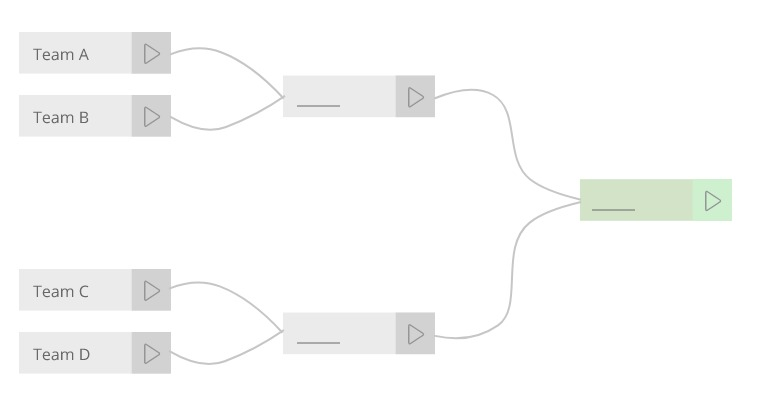

NIBO Front-end Challenge - Level 1
==============

Bem vindo à Summoners Rift. 

Você foi convocado a participar do mais empolgante desafio de sua vida: acabar com os intermináveis conflitos em Valoran. A nação humana de Demacia, o assombroso império de Noxus e os moradores de todas as cidades-estado aguardam ansiosamente por este momento.

Para isso ocorrerá um torneio onde o reino do vencedor terá o poder de controlar todos os outros em Valoran e precisamos que você desenvolva um sistema para gerenciar este torneio.

Regras
-------------------------
Os torneios tipicamente mata-mata são compostos por times e chaves, onde são gerados os vencedores de cada chave até chegar ao grande vencedor do torneio.
Seu objetivo é criar um sistema onde é possível cadastrar os times e gerenciar o torneio até a fase final, onde poderemos eleger o vencedor.

- Você deverá desenvolver uma solução em Javascript utilizando AngularJS. Você pode decidir sobre outras bibliotecas e tecnologias.
- Queremos como resultado uma solução simples, legível e de qualidade. 
- Código feito e comentado em **inglês** please.
- Não utilize soluções prontas. Nós as conhecemos.
- Seja criativo. Você decide quais funcionalidades irá incluir além dos requisitos.

Pontos extras
-------------------------
Você está livre para construir a solução com as tecnologias e conceitos que preferir. Mas você poderá ganhar pontos extras se:
- Utilizar ES6/ES2016+ ou Typescript
- Trocar o AngularJS por Angular 2/4
- Persistir os dados usando Local Storage ou Web SQL
- Utilizar pré-processadores CSS

Nós iremos avaliar a qualidade técnica do código CSS, HTML e Javascript além do aspecto visual e de usabilidade da aplicação.

Envio da solução
-------------------------

Ao final, você deverá criar um fork deste repositório, incluir o seu código fonte, incluir o seu currículo dentro da pasta "_about",  preencher o formulário "_about/Profile.md" e enviar para dev@nibo.com.br o link do seu fork.

Tenha capricho com seu código e com o resultado final. Essa é a sua chance de entrar para o melhor time, na startup que mais cresce no Brasil.

"Domine à si mesmo, e dominará seu inimigo" - Lee Sin

**NIBO - Desenvolvimento de alta performance para geeks inquietos**

Boa sorte :D
